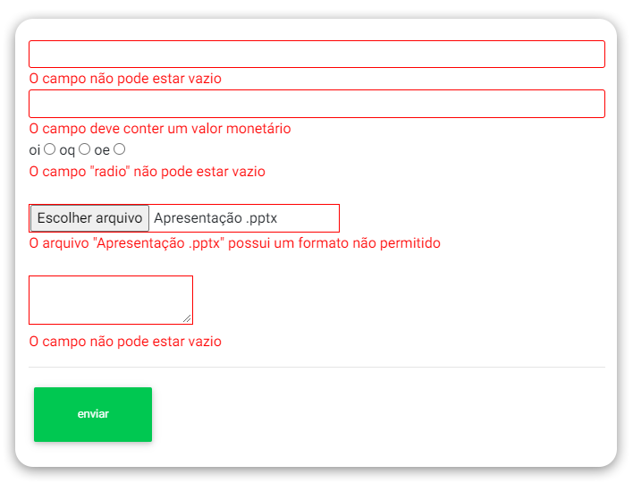

# jQuery-plugin-simple-form-validator



Plugin de validação de formulários para jQuery que utiliza apenas marcações em HTML.

## Utilização
Basta referenciar o jQuery e este plugin, a versão **3.1.1** é a que foi testada, o plugin valida os inputs no momento do submit do formulário.
```html
<script src="https://code.jquery.com/jquery-3.1.1.min.js"></script>
<script src="/jquery-simple-validator.js"></script>
```

## Inicialização
Se quiser que o plugin funcione em determinado form, basta que o mesmo tenha a classe **validate**.
```html
<form class="validate">
```

## Rules
Atualmente, o plugin conta com uma lista singela de regras de validação, porém muito úteis, são elas:
* **req** (required - text, file, radio, checkbox)
* **num** (numeric - text)
* **min** (min length - text, file)
* **max** (max length - text, file)
* **eql** (equal length - text, file)
* **dbr** (data no formato brasileiro - text)
* **dbd** (data no formato database - text)
* **mail** (e-mail - text)
* **tel** (nº de telefone - text)
* **cash** (valor monetário - text)
* **reg** (expressão regular - text)
* **ext** (file extension - file)
* **type** (file type - file)

## Aplicação das rules nos inputs
Basta que o input tenha o atributo **data-vrules**, ele pode receber várias, separadas por **pipe**, com exceção da rule **reg**, que precisa de um atributo **data-vreg** separadamente.
```html
<input type="text" name="nome" data-vrules="req|min[10]|max[90]">
<input type="text" name="numero" data-vrules="req|reg" data-vreg="\d">
```

## Customização de mensagens de erro
No input desejado, basta informar o atributo **data-vmsg-[nome-da-rule]**, por exemplo: **data-vmsg-req="mensagem de erro customizada"**, se o input possuir o atributo **data-vname**, o valor deste name substiruirá o coringa **{$}** na mensagem de erro, se ele existir.
```html
<input type="text" name="nome" data-vrules="req|min[5]" data-vname="nome de usuário" data-vmsg-req="O campo {$} é obrigatório">
```

## Plugin simples
Nada de **jQuery.extend()** ou manipulações do objeto via javascript, tudo é feito via HTML para facilitar ao máximo seu uso, afinal, não importa o quão escondido seja seu .js, ele sempre poderá ser desabilitado.
